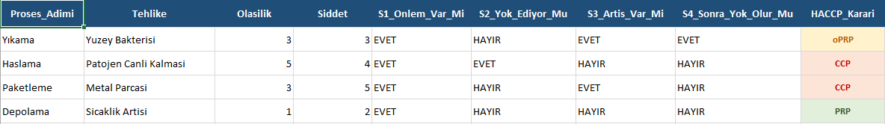

# 🛡️ Automated HACCP Decision Tree & Food Safety Verification Engine


Gıda güvenliği yönetim sistemlerinde (**BRCGS Food Safety Issue 9**, **ISO 22000:2018** ve **Codex Alimentarius CXC 1-1969**) tehlike analizi ve kritik kontrol noktası (CCP/oPRP) sınıflandırma süreçlerini otomatize eden Python tabanlı kural motoru.

Manuel takip edilen Excel tablolarındaki formül bozulmalarını, subjektif değerlendirme sapmalarını ve operatör hatalarını sıfırlamak üzere kurgulanmıştır.

---

## 📊 Örnek Denetim Çıktısı

Motor tarafından otomatik işlenen, renklendirilen ve kritik limitleri bağlanan final Excel raporu:



---

## ⚙️ Karar Motoru Mantığı (Decision Logic)

Sistem iki aşamalı bir doğrulama katmanından oluşur:

1. **Risk Değerlendirme Filtresi ($O \times Ş$):**
   * Tehlikeler Olasılık (1-5) ve Şiddet (1-5) matrisine göre puanlanır.
   * Risk Skoru $\le 8$ olan parametreler operasyonel yük oluşturmaması adına doğrudan **PRP (Ön Gereksinim)** olarak etiketlenir.
   * Risk Skoru $> 8$ olan kritik tehlikeler Codex Karar Ağacı protokolüne sevk edilir.

2. **Codex Alimentarius 4 Aşamalı Karar Ağacı:**
   * **S1 (Önleyici Faaliyet):** Önlem var mı? $\rightarrow$ *Yoksa: Proses Tasarımı Revizyonu*
   * **S2 (Eliminasyon / Azaltma):** Bu adım tehlikeyi kabul edilebilir seviyeye indiriyor mu? $\rightarrow$ *Evetse: **CCP***
   * **S3 (Artış Riski):** Tehlike kabul edilemez seviyeye çıkabilir mi? $\rightarrow$ *Hayırsa: PRP*
   * **S4 (Sonraki Adım Kontrolü):** Sonraki adımlarda bu tehlike elenecek mi? $\rightarrow$ *Evetse: **oPRP**, Hayırsa: **CCP***

3. **Otomatik İzleme & Limit Eşleme:**
   * Bir proses **CCP** çıktığı anda endüstriyel standart kütüphanesinden ilgili parametreleri otomatik çeker:
     * *Örn. Haşlama:* Sıcaklık $\ge 90$°C, Süre $\ge 90$ sn, PT100 sürekli sensör izleme, limit aşımında otomatik karantina ve tekrar işlem.
     * *Örn. Metal Dedektör:* Fe: 1.5 mm, Non-Fe: 2.0 mm, SS: 2.5 mm test çubukları, saatlik sinyal testi, limit aşımında son 1 saatlik lotu bloke etme.

---

## 🛠️ Teknik Altyapı

* **Çekirdek:** Python
* **Veri Analitiği:** `pandas` (Vektörize koşullu eşleme motoru)
* **Rapor Tasarımı:** `openpyxl` (Kurumsal hücre renklendirme, sınır çizgileri, otomatik sütun genişlik hesaplaması)

---

## 📁 Dizin Yapısı

```text
├── tehlike_listesi.xlsx        # Girdi: Tehlike parametreleri ve S1-S4 yanıtları
├── haccp_analiz.py             # Analiz algoritması ve openpyxl biçimlendirici
├── haccp_plani_final.xlsx      # Çıktı: Renk kodlu, denetime hazır HACCP planı
├── ekran_goruntusu.png         # README için görsel kanıt
└── README.md                   # Teknik dokümantasyon
